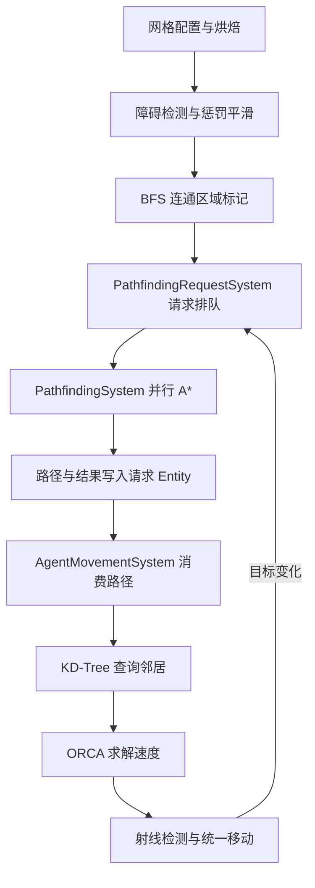

# Unity DOTS/ECS 多代理寻路系统

基于 Unity DOTS 的网格寻路与多代理局部避障学习项目，展示从网格数据准备、请求调度、并行 A* 到 KD-Tree 邻居查询、ORCA 速度求解的完整代码流程。

这是用于项目展示和代码阅读的源码版本，包含核心代码、示例场景、预制体、Unity 配置和包版本。演示使用的外部角色模型及动画未包含在仓库中，完整运行前需要补齐资源或使用自有模型替换。

## 环境

| 项目 | 版本 |
| --- | --- |
| Unity Editor | 2023.2.20f1c1 |
| Entities / Unity Physics | 1.3.8 / 1.3.8 |
| Entities Graphics | 1.4.5 |
| Collections / Burst | 2.5.1 / 1.8.18 |
| URP | 16.0.6 |

依赖的完整版本见 [Packages/manifest.json](Packages/manifest.json) 与 [packages-lock.json](Packages/packages-lock.json)。

## 主要实现

- **A* 寻路算法**：实现 A* 算法与手写 NativeMinHeap 最小堆，支持障碍物惩罚避让、BFS 替代终点及 GoToClosest 回退策略；通过 IJobParallelFor Job 与 Burst 并行计算寻路请求。
- **网格构建系统**：基于 Unity Physics OverlapBox 扫描网格障碍物并标记节点状态；采用可分离箱式滤波平滑扩散节点惩罚值；通过 BFS 洪水填充算法给节点标记连通岛屿 ID，在寻路前预检测起点与终点的连通性。
- **KD-Tree 构建与查询**：构建 KD-Tree，为所有代理划分空间，并通过 KD-Tree 查询每个代理最近的 K 个邻居，为后续 ORCA 避障提供邻居数据。
- **ORCA 多代理避障**：为邻居构造 ORCA Line，通过增量线性规划求解最优避障速度；约束冲突时构造 ProjectedLine，压低最大违反量并求出折中速度。
- **ECS 架构设计**：采用 Unity ECS 组件化设计，通过 PathfindingRequestSystem（寻路请求入队）→ PathfindingSystem（并行计算 A* 路径）→ AgentMovementSystem（路径跟随与 ORCA 避障移动），实现多代理寻路与移动。

## 系统流程

## 代码阅读入口

| 模块 | 入口 |
| --- | --- |
| 网格障碍与滤波 | [CheckObstaclesSystem.cs](Assets/Athomield/AStar/Systems/CheckObstaclesSystem.cs) |
| 岛屿标记 | [CheckNodeIslandSystem.cs](Assets/Athomield/AStar/Systems/CheckNodeIslandSystem.cs) |
| 请求排队 | [PathfindingRequestSystem.cs](Assets/Athomield/AStar/Systems/PathfindingRequestSystem.cs) |
| 并行寻路 | [PathfindingSystem.cs](Assets/Athomield/AStar/Systems/PathfindingSystem.cs) |
| A* 与路径回溯 | [PathfindingUtility.cs](Assets/Athomield/AStar/Utility/PathfindingUtility.cs) |
| 最小堆 | [NativeMinHeap.cs](Assets/Athomield/AStar/Utility/NativeMinHeap.cs) |
| KD-Tree / KNN | [KnnContainer.cs](Assets/Athomield/AStar/Utility/KNN/KnnContainer.cs) |
| ORCA 与代理移动 | [AgentMovementSystem.cs](Assets/Athomield/AStar/Systems/AgentMovementSystem.cs) |

## 打开项目

1. 克隆仓库，通过 Unity Hub 打开项目根目录，使用上表版本的编辑器。
2. 等待 Package Manager 恢复依赖，并允许 SubScene 完成导入与烘焙。
3. 阅读 [资源说明](DEPENDENCIES.md)，补齐或替换代理模型；缺少模型时相关场景引用可能显示 Missing。
4. 打开 `Assets/Athomield/AStar/Demos/GroupTarget/GroupTarget.unity`。其目标球由方向键控制，代理持续跟踪移动目标。
5. 也可以查看 `Assets/Athomield/AStar/Demos/CircleOfAgents/COA.unity` 的场景配置与对应 SubScene。

邻居数量、最大速度、障碍配置会影响避障效果；约束冲突时得到的是折中速度，不代表所有约束都能同时满足。仓库不提供未经测量的帧率或零分配保证。本次发布核对了文件与依赖清单，未在清洁环境中完成 Unity 导入和运行测试。
